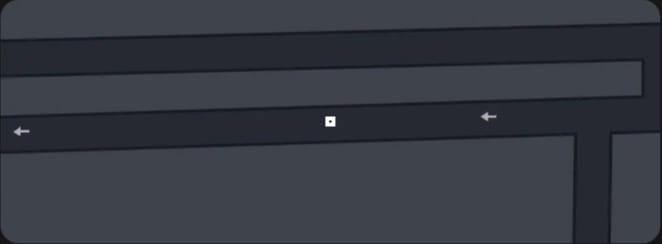

# 🚖 Ride Details Web UI  

This project is a **Ride Details Web UI** built with **HTML & CSS**, inspired by ride-sharing apps like Uber.  
It provides a clean and modern way to display **trip details, driver info, fare, pickup & drop locations, and receipts**.  


---

## ✨ Features  
- Dark themed UI with modern styling  
- Driver profile photo in circular frame  
- Ride info with **date, time, and fare**  
- Pickup & Drop locations with icons and timestamps  
- Interactive buttons: **Receipt**, **Invoice**, **Add Tip**, **Rate**  
- Responsive design for mobile screens  
- Easily customizable via HTML  

---

## 🛠️ Tech Stack  
- **HTML5**  
- **CSS3 (Flexbox, Responsive Design)**  
- **Font Awesome** for icons  

---

## 🚀 Getting Started  

## 📂 Project Structure

```
ride-details-ui/
│-- index.html       # Main UI file
│-- style.css        # (Optional) external stylesheet (currently inline in index.html)
│-- img2.jpg         # Driver profile photo
│-- img3.jpg         # Map image
│-- README.md        # Documentation
```

---

## 📝 Customization Guide

You can update ride details directly in `index.html`.

### 🔹 Change Driver Name

```html
<h1>Bike ride with<br><strong>PRASHANT</strong></h1>
```

➡ Replace `PRASHANT` with the driver’s name.

---

### 🔹 Change Date, Time & Fare

```html
<div class="meta">
  <span>Oct 3 2:06PM <br> ₹62.21 </span>
</div>
```

➡ Replace with your **date, time, and fare**.

---

### 🔹 Change Pickup & Drop Addresses

```html
<div class="locations">
  <div class="loc">
    <div class="dot"></div>
    <div class="loc-text">Pickup Address Here...</div>
    <div class="time">2:12 PM</div>
  </div>
  <div class="loc">
    <div class="square"></div>
    <div class="loc-text">Drop Address Here...</div>
    <div class="time">2:23 PM</div>
  </div>
</div>
```

➡ Replace the **loc-text** and **time** values with your ride details.

---

### 🔹 Change Driver Photo

```html
<div class="profile">
  
</div>
```

➡ Replace `img2.jpg` with your own photo file (keep inside project folder).

---

### 🔹 Change Map Image

```html
<div class="map-wrap">
  
</div>
```

➡ Replace `img3.jpg` with your own map screenshot (e.g., `map.png`).

---

## 📌 Future Improvements

* Make **fully responsive** for all devices (mobile-first)
* Add **JavaScript** for dynamic ride data
* Connect with **Google Maps API** for live routes
* Add **downloadable PDF receipt** option

---


## ⭐ Contribute

If you’d like to improve this project, feel free to fork it and submit a pull request.

```
